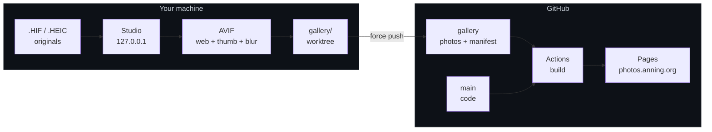
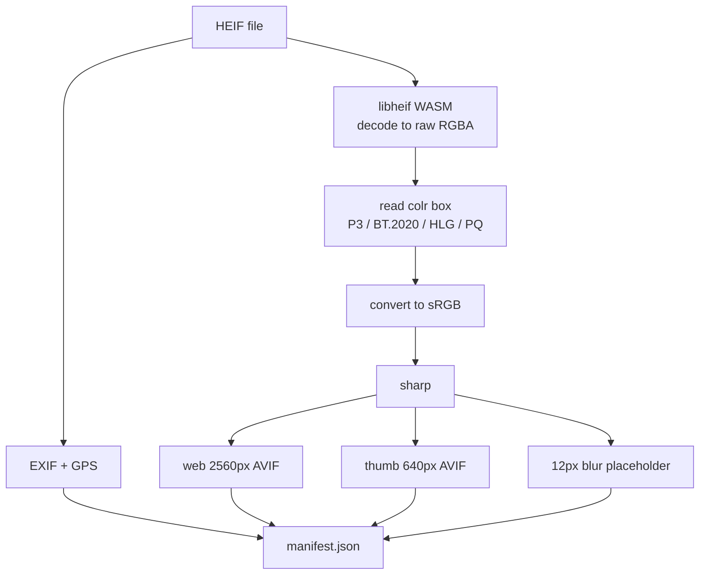
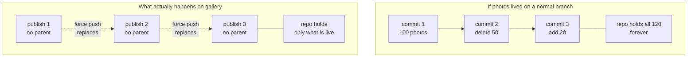

# photos

A private-ish photo gallery for family. Drag `.HIF` files from a Sony A7R V or `.HEIC` from an
iPhone into a local studio app, it compresses them to AVIF, pushes to GitHub, and a couple of
minutes later they are live at <https://photos.anning.org>. Runs entirely on free tiers.

---

## How it fits together

Nothing runs on a server. The studio is a local app that does the expensive work on your machine
and commits the results; GitHub only ever builds a static site out of what it is given.



The two branches are built together: the workflow checks out `main` for the site code and
`gallery` for the photos, then splices them in `scripts/collect.mjs`.

### What happens to one photo



---

## Daily use

Double-click `start.cmd`. The studio opens in a browser.

| Step | What you do | Notes |
| --- | --- | --- |
| 1 | Drag photos in | Originals never leave the machine |
| 2 | Pick a quality tier | Applies to this batch, see below |
| 3 | Wait for decoding | Untick anything you do not want; fix orientation with the rotate buttons |
| 4 | Name the album, publish | GitHub Actions rebuilds; live in a minute or two |

The bar in the top right is the GitHub Pages quota. The budget is 800 MB by default and the hard
Pages ceiling is 1 GB — **exceeding it makes deployment fail**, so delete old albums under
**Manage** before you get close.

### Quality tiers

Chosen per batch, because encoding happens the moment you press process. Measured on one 61 MP
Sony frame at 2560 px, total of web image plus thumbnail:

| Tier | AVIF quality | Per photo | vs standard | Photos in 800 MB |
| --- | --- | --- | --- | --- |
| Standard | 58 / 50 | 225 KB | — | ~3,600 |
| High | 66 / 55 | 291 KB | +29% | ~2,800 |
| Max | 75 / 60 | 390 KB | +73% | ~2,100 |

Those counts come from a single night shot, which compresses better than a detailed daylight
scene — treat them as an upper bound rather than a promise.

The tier is recorded alongside the staged file, so re-encoding one photo with the rotate button
does not silently drop it back to standard.

---

## Privacy boundary

Read this once. The protection here is **a soft gate, not encryption**.

| Property | Status |
| --- | --- |
| Indexed by search engines | No — `robots.txt` plus `noindex` on every page |
| Passcode before any photo loads | Yes — not one thumbnail is requested until it is entered |
| Passcode checked on a server | **No** — it is checked in the browser |
| Photo files themselves protected | **No** — they sit in a public repository |

Anyone who guesses or is given a direct image URL bypasses the gate entirely, as does anyone who
reads the page source. The repository has to be public because GitHub does not offer Pages on
private repositories for free accounts.

If you ever want a real login, deploy `dist/` to Cloudflare Pages behind Cloudflare Access
(also free, up to 50 users). No site code would need to change.

**Location data is stripped by default.** GPS coordinates are only written when you tick
"show this album's location" at publish time, per album. Leave it off for anything shot at home.

---

## Why the photos are not on `main`

Git keeps every version of every file it has ever committed, so a photo deleted from a normal
branch frees no space at all. The photos therefore live on an orphan branch that is replaced
wholesale on every publish:



The repository is therefore always exactly as large as the current gallery, and pushes stay cheap
because git deduplicates by content hash. Two consequences worth knowing:

- **Locally**, the overwritten objects linger. **Manage → Reclaim local disk** runs
  `git reflog expire` plus `git gc --prune=now` to drop them.
- **On GitHub**, unreachable objects are not deleted immediately either. Someone who recorded a
  commit SHA could still fetch it until GitHub runs its own garbage collection. Deleting a photo
  is not a recall.

### Publishing from more than one machine

Because every publish is a force-push of a parentless commit, git has no ancestry with which to
protect you: publishing from a machine that missed someone else's upload would silently delete
their photos. The studio therefore fetches and compares the committed tree before pushing, and
refuses if they differ. If it stops you:

```powershell
git -C gallery fetch origin gallery
git -C gallery reset --hard FETCH_HEAD
```

---

## Layout

| Path | What lives there |
| --- | --- |
| `start.cmd` | Double-click to launch; installs Node / git / deps if missing |
| `config.json` | Title, budget, passcode hash, quality tiers |
| `MANIFEST.md` | Data contract for `manifest.json` |
| `studio/` | The local upload app — never deployed |
| `site/` | Astro static site; this is what ships |
| `gallery/` | Photos + manifest, a worktree of the `gallery` branch |
| `scripts/` | Setup, the post-build collect step, and the tests |

Each module under `studio/lib/` opens with a header comment explaining what it is for and why it
works the way it does. Those comments are the reference for decoding, colour handling,
orientation, concurrency and the git plumbing; this README deliberately does not restate them,
so that there is only one copy to keep true.

**Known scaling limit.** The home page is one static HTML document carrying roughly 1 KB per photo,
mostly the inline blur placeholder. A few hundred photos is 200–400 KB and entirely fine; past a
thousand or so the page approaches 1 MB and would need pagination or lazy loading.

---

## Troubleshooting

| Symptom | Fix |
| --- | --- |
| Site did not update | Check the repository's Actions tab. A failure in `collect` usually means the 1 GB quota was exceeded |
| Photo is sideways | Use the 90° / 180° / 270° buttons on the card; that one photo is reprocessed |
| Deployment rejected, site too large | Delete old albums under **Manage**, then **Reclaim local disk** |
| Out of memory while processing | Set `"concurrency": 1` in `config.json` |
| Passcode change did not take effect | Save under **Manage → Site settings**; that publishes immediately. Family must enter the new passcode |
| Publish refused, remote disagrees | Another machine published. See *Publishing from more than one machine* above |
